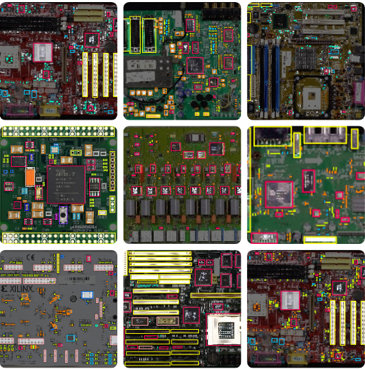
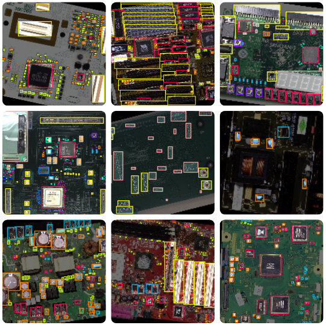

# YOLO Ensemble Learning for PCB Component Detection

This repository contains the code and experiments results for our paper on ensemble-based YOLO object detection applied to printed circuit board (PCB) component detection for automated e-waste recycling.

We evaluate six YOLO models (v5s, v8s, v9s, v10s, v11s, v12s) and three ensemble fusion strategies — **Standard NMS**, **Voting-Based**, and **Weighted Voting-based WBF** — for detecting four PCB component classes.

---

## Results Summary

| Method | mAP@0.5 | F1 | FPS | FEI |
|---|---|---|---|---|
| YOLOv8s (baseline) | 54.04% | 55.9% | 15.97 | 0.672 |
| NMS Top-3 | 56.56% | 59.1% | 4.95 | 0.411 |
| **Consensus Top-3** | **58.94%** | **60.2%** | 3.69 | 0.341 |
| Grid Search WBF | 52.26% | 60.6% | 3.69 | 0.343 |

> FEI (Fusion Efficiency Index) = F1 × log₁₀(FPS). Higher is better.

---

## Dataset

|     Samples from testing dataset      |     Samples from training dataset      |
|:-------------------------------------:|:--------------------------------------:|
|  |  |


- **Source:** [Roboflow — Printed Circuit Board](https://universe.roboflow.com/roboflow-100/printed-circuit-board) (License: CC BY 4.0)
- **Classes:** IC, Capacitor, Connector, Electrolytic Capacitor (filtered from 23 original classes)
- **Split:** 543 train / 77 validation / 41 test images

> The dataset images are not included in this repository due to size. Download from the Roboflow link above and place under `datasets/`.


## Class Mapping

| Class ID | Component |
|---|---|
| 0 | IC (Integrated Circuit) |
| 1 | Capacitor |
| 2 | Connector |
| 3 | Electrolytic Capacitor |

---


## Setup

### Requirements

- Python 3.9+
- PyTorch (CUDA recommended)
- Ultralytics

```bash
pip install ultralytics ensemble-boxes torch torchvision tqdm matplotlib numpy pillow
```

### Trained Weights

Trained model weights are not tracked in this repository due to file size.

Place them under the `training/` directory.

---

## Training

Train each model individually using the scripts in `training/`:

```bash
# YOLOv5s
python scripts/training/train_yolov5s_ultralytics.py

# YOLOv8s
python scripts/training/train_yolov8.py

# YOLOv9s
python scripts/training/train_yolov9s_ultralytics.py

# YOLOv10s
python scripts/training/train_yolov10.py

# YOLOv11s
python scripts/training/train_yolov11.py

# YOLOv12s
python scripts/training/train_yolov12.py
```

**Training parameters** (consistent across all models):
- Image size: 640×640
- Batch size: 16
- Epochs: 100
- Optimizer: SGD
- Pre-trained weights: COCO (transfer learning)

---

## Ensemble Methods

### Method 1: Standard NMS

Combines predictions from the top-N models using standard Non-Maximum Suppression.

```bash
python ensemble/nms.py
```

### Method 2: Consensus Voting

Applies affirmative, consensus, or unanimous voting before NMS fusion.
A detection is only kept if a minimum number of models agree on it.

```bash
python ensemble/ensemble_voting_experiment.py
```

### Method 3: Weighted Voting WBF

Fuses boxes from multiple models using confidence-weighted averaging.
Includes both static weights and grid search optimization.

```bash
python ensemble/voting_methods/run_experiments.py
```

---

## Citation

If you use this code or dataset in your research, please cite our paper:

```bibtex
@article{zhou2026pcbensemble,
  title   = {Ensemble YOLO Models for PCB Component Detection in E-Waste Recycling},
  author  = {Zhou, Xinglong and Agaian, Sos},
  journal = {Information},
  year    = {2026}
}
```

---

## Acknowledgements

- [Ultralytics YOLO](https://github.com/ultralytics/ultralytics)
- [WongKinYiu/yolov9](https://github.com/WongKinYiu/yolov9)
- [Weighted Boxes Fusion](https://github.com/ZFTurbo/Weighted-Boxes-Fusion)
- Dataset: [Roboflow Printed Circuit Board](https://universe.roboflow.com/roboflow-100/printed-circuit-board)
